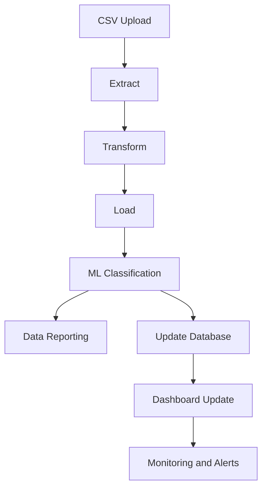
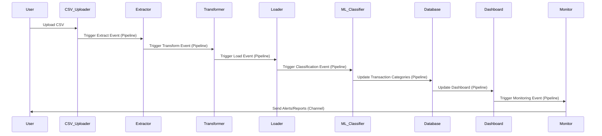

# Budget App

## Overview

This budget app aims to provide an automated way to categorize and manage transactions exported from a bank as a CSV file. It combines an Event-Driven Architecture (EDA) with an ETL (Extract, Transform, Load) process to offer a flexible, scalable, and maintainable solution.

---

## Terminology

- **Pipeline**: A component with one producer and one consumer, facilitating a one-to-one relationship and data flow between them.
- **Channel**: A communication medium for events in an Event-Driven Architecture (EDA). Channels can be direct (one-to-one) or broadcast (one-to-many).

---

## Architecture

The system combines various architectural patterns:

- **EDA (Event-Driven Architecture)**: For initiating and managing individual components.
- **ETL (Extract, Transform, Load)**: For processing the raw transaction data.

### Mermaid Diagram

### Sequence Diagram

---

## Event Producers and Consumers

### Event Producers

1. **CSV Uploader**: Produces a "CSV Uploaded" event, triggering the Extractor.
2. **Extractor**: Produces an "Extraction Completed" event, triggering the Transformer.
3. **Transformer**: Produces a "Transformation Completed" event, triggering the Loader.
4. **Loader**: Produces a "Load Completed" event, triggering the ML Classifier.
5. **ML Classifier**: Produces an "ML Classification Completed" event, triggering database updates.
6. **Database**: Produces an "Update Completed" event, triggering the Dashboard and Monitor.
7. **Monitor**: Produces alert events, potentially triggering manual intervention or automated remediations.

### Event Consumers

1. **Extractor**: Consumes the "CSV Uploaded" event.
2. **Transformer**: Consumes the "Extraction Completed" event.
3. **Loader**: Consumes the "Transformation Completed" event.
4. **ML Classifier**: Consumes the "Load Completed" event.
5. **Database**: Consumes "ML Classification Completed" events.
6. **Dashboard**: Consumes "Update Completed" events.
7. **Monitor**: Consumes "Dashboard Updated" events.
8. **User/Admin**: Consumes alert events for potential action.

---

## Security Measures

- **Zero Trust Architecture**: The system employs a Zero Trust approach to ensure stringent access control. Every request for access is authenticated, authorized, and encrypted before being processed.
  
  - Data in transit is encrypted.
  - No implicit trust: Verification is required from anyone trying to access resources in the network.
  - Least-Privilege Access: Principles of least privilege are applied to minimize access rights for users (or systems) to the bare minimum necessary to complete the task.

---
